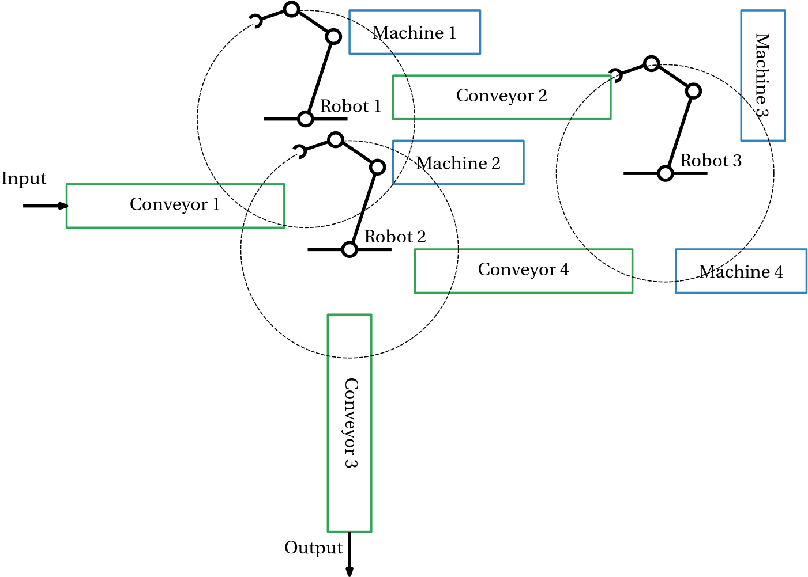

## Exercise 1: manufacturing system with multiple machines, conveyor belts and robotic arms

**Goal:** formulating a Petri net model for a manufacturing system with multiple machines, conveyor belts and robotic arms.

{width=80%}
